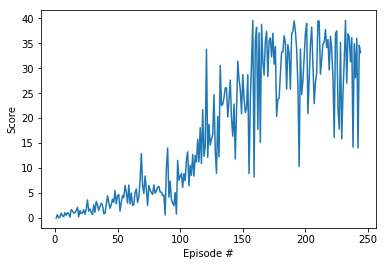

# DDPG Continous-Control

### Description
This is an implementation for solving the reacher environment using the DDPG (Deep Deterministic Policy Gardient) algorithm. The model is for a single agent and the end goal is to achieve +30 / 100 consecutive episodes.

#### Environment

In this environment, a double-jointed arm can move to target locations. A reward of +0.1 is provided for each step that the agent's hand is in the goal location. Thus, the goal of your agent is to maintain its position at the target location for as many time steps as possible.

The observation space consists of 33 variables corresponding to position, rotation, velocity, and angular velocities of the arm. Each action is a vector with four numbers, corresponding to torque applicable to two joints. Every entry in the action vector should be a number between -1 and 1.

### Local Installation

For this project, you will not need to install Unity - this is because we have already built the environment for you, and you can download it from one of the links below. You need only select the environment that matches your operating system:

##### Single Agent

Linux : https://s3-us-west-1.amazonaws.com/udacity-drlnd/P2/Reacher/one_agent/Reacher_Linux.zip
Windows 32-bit : https://s3-us-west-1.amazonaws.com/udacity-drlnd/P2/Reacher/one_agent/Reacher_Windows_x86.zip
Windows 64-bit : https://s3-us-west-1.amazonaws.com/udacity-drlnd/P2/Reacher/one_agent/Reacher_Windows_x86_64.zip
Mac OSX  : https://s3-us-west-1.amazonaws.com/udacity-drlnd/P2/Reacher/one_agent/Reacher.app.zip

### Model's Performance

Episode 100	Average Score: 3.55
Episode 200	Average Score: 23.62
Episode 244	Average Score: 30.01
Environment solved in 244 episodes!	Average Score: 30.01
